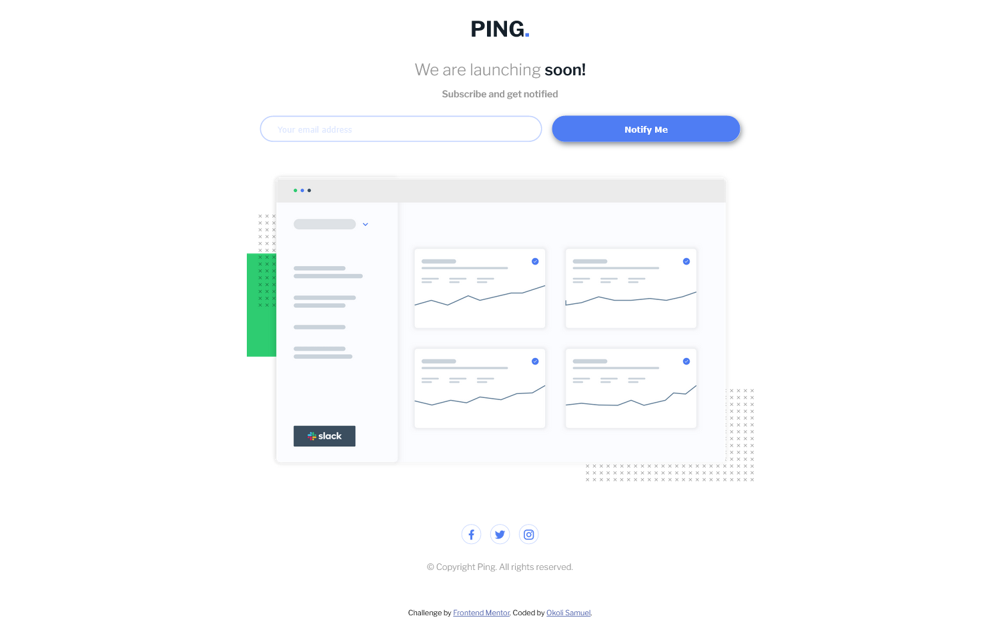
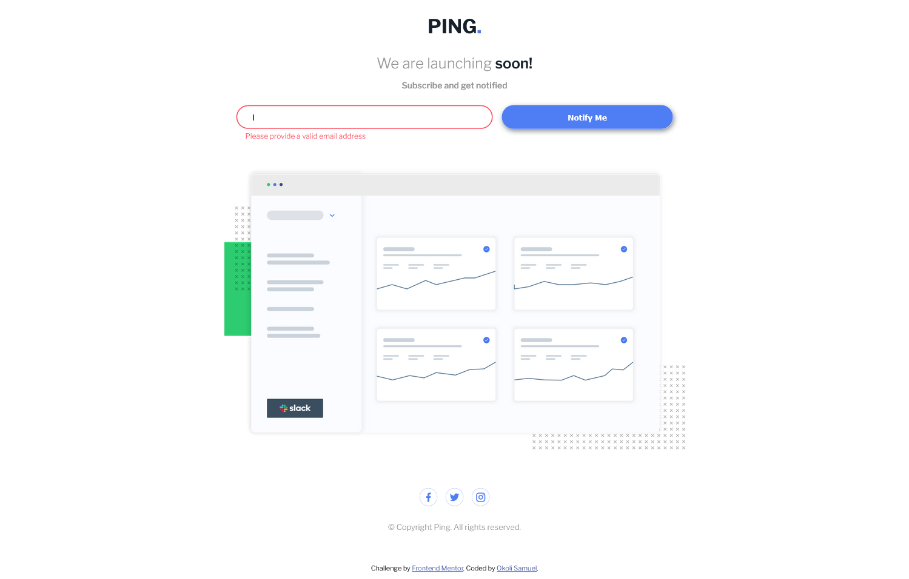
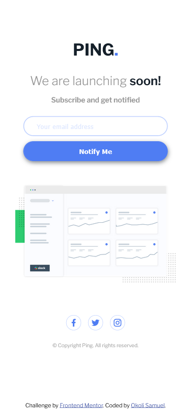

# Frontend Mentor - Ping coming soon page solution

This is a solution to the [Ping coming soon page challenge on Frontend Mentor](https://www.frontendmentor.io/challenges/ping-single-column-coming-soon-page-5cadd051fec04111f7b848da). Frontend Mentor challenges help you improve your coding skills by building realistic projects. 

## Table of contents

- [Overview](#overview)
  - [Project Dependencies](#project-dependencies)
  - [The challenge](#the-challenge)
  - [Screenshot](#screenshot)
  - [Links](#links)
- [My process](#my-process)
  - [Built with](#built-with)
  - [What I learned](#what-i-learned)
  - [Continued development](#continued-development)
  - [Useful resources](#useful-resources)
- [Author](#author)
- [Acknowledgments](#acknowledgments)

## Overview

### Project Dependencies
```
$ npm install
$ npm start

```

### The challenge

Users should be able to:

- View the optimal layout for the site depending on their device's screen size
- See hover states for all interactive elements on the page
- Submit their email address using an `input` field
- Receive an error message when the `form` is submitted if:
	- The `input` field is empty. The message for this error should say *"Whoops! It looks like you forgot to add your email"*
	- The email address is not formatted correctly (i.e. a correct email address should have this structure: `name@host.tld`). The message for this error should say *"Please provide a valid email address"*

### Screenshot

Below are screenshots of the project challenge;
exeptions on:
- Hover effects on desktop version;
- Hover effects on Mobile version;









### Links

- Solution URL: [gitHub]([https://your-solution-url.com](https://github.com/X4MU-L/Ping_FrondendMentor_challenge.git))

## My process

### Built with

- Semantic HTML5 markup

  A ```main``` tag was used to for the project container.

  A ```header``` tag was used to wrap the logo and the followed writeups before the the ```input```.

  A ```form``` tag was used to markup the ```input``` and ```button``` in the project.

  A ```footer``` tag was used to markup the *social-icons* as well as the *copyright reserved* . 
  
- CSS custom properties

  No CSS custom property was declared or reused sadly 😥, hopes to improve on it.

- Flexbox

  Flexbox was used in this project even though i dont yet have a proper understanding about it.., will be glad to get directions on how to tearn more.

- Mobile-first workflow

- CSS Framworks

  No CSS Framwork was used in the course of this project' though i hope to use some in future projects.

- [Remixcon](https://remixicon.com//) - For Icons

### What I learned

- I have been able to learn to an extent how to flex and center contents to a page.

- I have also learnt how to fit an image into it's container.

- On overall subcontiously I have learnt a lot that i can't really pen them all down, but i hope to keep learning and solving more challenges as the day goes by.

The codes below are some of the code i was quite proud of in the course of this Challenge;
Though i may be proud of them, i look forward to critics on this if you came across this as on overall i'm hoping to improve.

Free free to use the comment section or better still send me an [Email](mailto:okolisamuel21@gmail.com) with your update version.

Thanks in advance.

```html
<form action="#">
        <div class="forms">
          <div class="input-field">
            <input class="input" type="text" placeholder="Your email address" />
            <p class="error-message"></p>
          </div>
          <div>
            <button class="btn">Notify Me</button>
          </div>
        </div>
      </form>
```
```css 
  - on media Query

   form{
        width: 100%;
        padding: 0 20px;
    }
    .forms{
        flex-direction: row;
        gap: 15px;
        flex: 4;
    }
    .forms .input-field{
        flex: 3;
    }
    .forms p{
        font-size: 12px;
        text-align: left;
        margin-left: 15px;
    }
    .forms :nth-child(2){
        flex: 2;
    }
    .forms button{
        margin-top: 10px;
    }
```
```js
 const setErrorMessage = (selected,message) =>{
      const inputField = selected.parentElement;
      inputField.querySelector(".error-message").textContent = message;
      inputField.classList.add("error")
  }
```

### Continued development

In the course of this project I have come to learn that i seriously needs some development in these areas;
- Flexbox - Flexbox is currently one of my greatest challenge as of late and I am hoping to get directions on where to learn more on this and develop.

- Grid - Also as important as flexbox i hope to learn grid critically and understand its concept properly.

- Semantic and Assibility HTML Markup - Obviously a very great challenge i hope to overcome.

- CSS Frameworks - Last but not the least i look forward to making use of *CSS frameworks* in my code even though i'm looking forward on improving greatly in my CSS skills before making use of frameworks.

### Useful resources

- [Remixcon](https://remixicon.com/) - This helped me to add nice icons to the project challenge

## Author

- Twitter - [@iamwizzbrown](https://www.twitter.com/iamwizzbrown)

## Acknowledgments

Special credits goes to [MentorTribes](https://www.mentortribes.com/) for their coaching over the past few months.
They have really been instrumental to my **CODING** growth.

